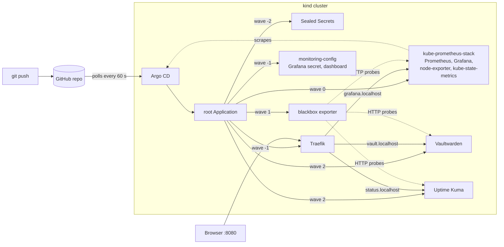
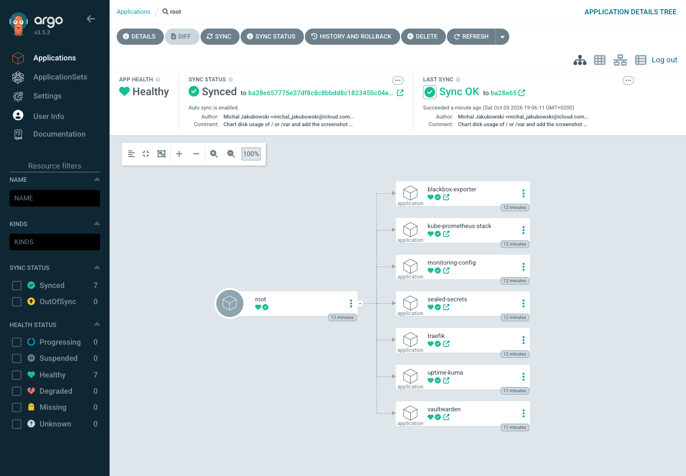
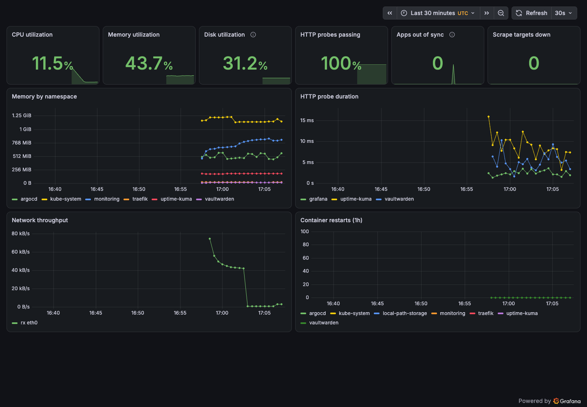
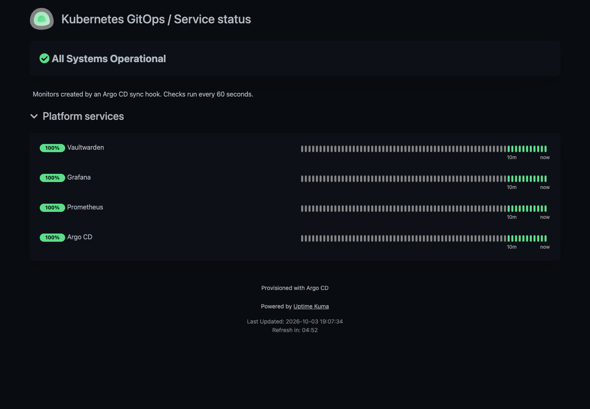

# Kubernetes GitOps Portfolio

[](https://github.com/michaljakubowski2001/k8s-gitops-portfolio/actions/workflows/ci.yml)

> **TL;DR** – The services from [mikrus-devops-portfolio](https://github.com/michaljakubowski2001/mikrus-devops-portfolio) on Kubernetes, deployed only by Argo CD from this repository.
> - Every push builds a fresh kind cluster in GitHub Actions, lets Argo CD sync all 8 Applications from that commit and runs 13 end-to-end checks.
> - Secrets in Git as Sealed Secrets, images pinned to digests, Pod Security `restricted` and default-deny NetworkPolicies for the apps.
> - The checks prove it: probes, network isolation, Pod Security and Argo CD self-healing are tested, not just configured.
> - Real failures and fixes: see [Troubleshooting log](#troubleshooting-log).

Vaultwarden, Uptime Kuma, Prometheus, Grafana and node-exporter run on a single-node Kubernetes cluster. Nothing is installed with `kubectl apply` or `helm install` by hand except Argo CD itself: one root Application renders the rest from a Helm chart, in sync waves, all pinned to the same Git commit.

**Status:** verified end to end in CI ([run](https://github.com/michaljakubowski2001/k8s-gitops-portfolio/actions/runs/37139258143) for [`ba28e65`](https://github.com/michaljakubowski2001/k8s-gitops-portfolio/commit/ba28e657775e27df8c8c8bbdd8c1823450c04e5b): all Applications Synced and Healthy after 121 s, 13/13 checks passed) and on a local kind cluster. It runs on kind, not on a public server, so there is no live demo link. See [verification evidence](docs/verification.md).

## Highlights

- **GitOps, app-of-apps.** `bootstrap/root-app.yaml` is the only Application created by hand. It renders 7 child Applications from `platform/` with sync waves: Sealed Secrets → Traefik and Grafana's secret → kube-prometheus-stack → blackbox exporter → apps. A custom health check makes each wave wait for the previous one to be Healthy.
- **Every commit tested on a real cluster.** CI creates a kind cluster, installs Argo CD, points it at the exact commit under test and waits for all 8 Applications. A broken manifest fails the pull request, not the next deploy.
- **Offline validation first.** `scripts/validate.sh` renders the platform chart, every upstream Helm chart with the values from its Application, the kustomize apps and Argo CD itself: about 250 resources checked with kubeconform, including Argo CD and Sealed Secrets CRDs.
- **Secrets safe in a public repository.** Grafana's and Kuma's admin passwords are committed only as SealedSecrets. The sealing key pair is created outside the cluster, so the same encrypted files work on any rebuilt cluster; the private key lives only in a GitHub secret and on my machine.
- **Isolation that is tested.** Vaultwarden and Uptime Kuma run as non-root with read-only root filesystems under Pod Security `restricted`, behind default-deny NetworkPolicies in both directions. CI checks that a pod from another namespace is blocked and that a privileged pod is rejected.
- **Monitoring as code.** The Grafana dashboard is a ConfigMap in Git. Blackbox exporter probes every service. Uptime Kuma's admin, monitors and public status page are created by an idempotent Argo CD sync hook, ported from the Mikrus Ansible role.

## Architecture



| Component | Source | Namespace | Pod Security |
|---|---|---|---|
| Argo CD v3.5.3 | `bootstrap/argocd` (upstream manifest, kustomize patches) | `argocd` | — |
| Sealed Secrets 0.40.0 | Helm chart 2.20.0 | `kube-system` | — |
| Traefik v3.7.13 | Helm chart 41.6.1 | `traefik` | restricted |
| kube-prometheus-stack | Helm chart 91.9.0 | `monitoring` | privileged (node-exporter) |
| Blackbox exporter | Helm chart 11.19.1 | `monitoring` | privileged (shared namespace) |
| Vaultwarden 1.37.3 | `apps/vaultwarden` (kustomize) | `vaultwarden` | restricted |
| Uptime Kuma 2.5.5 | `apps/uptime-kuma` (kustomize) | `uptime-kuma` | restricted |

## Design decisions

- **Argo CD bootstrapped by a script, not by itself.** `scripts/bootstrap.sh` installs Argo CD from the pinned upstream manifest and applies the root Application. Letting Argo CD manage its own installation is possible, but it adds a circular dependency that is not worth it for one cluster.
- **One revision for everything.** The root Application passes its Git revision to the platform chart, so every child Application tracks the same commit. CI sets it to the commit under test; on a long-lived cluster it is `main`.
- **Sync waves with real health.** Argo CD no longer reports the health of child Applications by default. Without the health check in `bootstrap/argocd/argocd-cm.yaml`, all waves would start at once and the apps would fail until Sealed Secrets and the Prometheus CRDs existed.
- **Kuma's setup page is never exposed.** Uptime Kuma lets the first visitor create the admin account. The configure Job runs in sync wave 1, and the Ingress is created only in wave 2, after the Job has set the password. The Mikrus project solves the same problem by configuring Kuma before Nginx starts.
- **Sealed Secrets with my own key.** The controller normally generates its key inside the cluster, so a rebuilt cluster cannot decrypt secrets sealed for the old one. Here the key pair is created once with OpenSSL; `bootstrap.sh` restores it before the controller starts, and key renewal is disabled.
- **`*.localhost` host names.** Browsers treat `http://*.localhost` as a secure context, which Vaultwarden's web vault needs for Web Crypto. A domain such as `localtest.me` would also resolve to 127.0.0.1 but would not be a secure context over plain HTTP.
- **Same services, different packaging.** Vaultwarden and Uptime Kuma use the same image digests and memory limits as the Mikrus project. Prometheus and Grafana come from kube-prometheus-stack instead of single containers, because the operator and its ServiceMonitors are how Kubernetes clusters are usually monitored; they get more memory than on the 2 GB VPS.

## Security

- **Secrets:** only SealedSecrets in Git, encrypted for one name and namespace each. `bootstrap/sealing-cert.pem` is the public half; `*.key` is in `.gitignore`. The Sealed Secrets key is a repository secret, available only to jobs from this repository, never to pull requests from forks.
- **Workloads:** non-root UID 1000, `readOnlyRootFilesystem`, all capabilities dropped, `RuntimeDefault` seccomp, no service account token, memory limits on every container.
- **Network:** default-deny ingress and egress in `vaultwarden` and `uptime-kuma`. Vaultwarden accepts only Traefik, the blackbox exporter and Uptime Kuma, and may only reach DNS (icon downloads are disabled). Kuma may reach DNS and the namespaces it monitors.
- **Supply chain:** application images are pinned to digests, Helm charts and the Argo CD manifest to exact versions, GitHub Actions to commit SHAs. kubeconform is installed in CI only after its SHA-256 checksum is verified.
- **Argo CD UI:** not exposed through Traefik; reached with `kubectl port-forward` only.
- **Known limits:** the `monitoring` namespace must allow privileged pods for node-exporter. Traffic is plain HTTP on the loopback interface; there is no TLS because nothing is exposed beyond `127.0.0.1`.

## Troubleshooting log

Real failures from building this project and how they were fixed.

**1. Every Ingress stuck in `Progressing`**
- *Problem:* after the first sync, Traefik and every Application with an Ingress stayed `Progressing`, even though `curl http://vault.localhost:8080/alive` already returned 200.
- *Cause:* I set `service.type: NodePort`, but chart 41.x reads `service.spec.type`, so Traefik got a LoadBalancer Service whose external IP stayed `<pending>` on kind. Argo CD considers an Ingress healthy only when it has a load-balancer address, and Traefik had none to publish.
- *Fix:* `service.spec.type: NodePort` and an explicit `ingressEndpoint.ip: 127.0.0.1` so Traefik writes the address the user really connects to into each Ingress status ([`f97da84`](https://github.com/michaljakubowski2001/k8s-gitops-portfolio/commit/f97da840e0d458dbf52f8999fc91de9be04b64b3)). To catch this kind of mistake earlier, `scripts/validate.sh` now renders each upstream chart with the exact values from its Application.

**2. NetworkPolicy blocked the monitoring it was meant to allow**
- *Problem:* all Applications were Synced and Healthy, but the smoke test failed: the blackbox probe for Vaultwarden reported `probe_success 0` and Uptime Kuma showed Vaultwarden down. Traefik could still reach it.
- *Cause:* the kustomization added common labels with `includeSelectors: true`. Kustomize applies them to every selector it knows, including the `podSelector` inside NetworkPolicy `from` rules. The rule meant "blackbox exporter pods" became "pods named both blackbox exporter and vaultwarden", which match nothing. Traefik worked because its rule used only a namespace selector.
- *Fix:* `includeSelectors: false` and explicit selectors on the Deployment and Service ([`06066a8`](https://github.com/michaljakubowski2001/k8s-gitops-portfolio/commit/06066a89080c382c4598beb3d225710230c64bb3)). Argo CD could not catch this: the manifests were valid, they just meant something else. The smoke test's probe check did, and it runs on every commit.

**3. Disk panel showed "No data"**
- *Problem:* the Grafana disk panel copied from the Mikrus dashboard was empty.
- *Cause:* on a kind node `/` is an overlay filesystem, which node-exporter skips. The node's real disk is mounted at `/var`, where images and volumes live.
- *Fix:* the panel shows the fuller of `/` and `/var`, which works on kind, k3s and a normal host ([`ba28e65`](https://github.com/michaljakubowski2001/k8s-gitops-portfolio/commit/ba28e657775e27df8c8c8bbdd8c1823450c04e5b)).

## Screenshots

Captured from the local kind cluster with `scripts/capture-screenshots.py`.

**Argo CD: root Application and its 7 children, all Synced and Healthy**



**Grafana: platform dashboard provisioned from Git**



**Uptime Kuma: status page created by the sync hook**



The tile view of all Applications with their sources and revisions is in [`docs/screenshots/argocd-apps.png`](docs/screenshots/argocd-apps.png).

## Cost

Nothing. The cluster runs on kind, locally or on a GitHub-hosted runner; a full CI run takes about 4.5 minutes. Measured working set on the local cluster with everything synced: about 2.7 GiB in total, of which Kubernetes itself (`kube-system`) uses 1.2 GiB, monitoring 0.7 GiB, Argo CD 0.6 GiB, Uptime Kuma 180 MiB, Traefik 19 MiB and Vaultwarden 12 MiB.

## How to run

Requirements: Docker (or Colima), kind, kubectl, yq, and the sealing key in `~/.config/k8s-gitops-portfolio/sealing.key`.

```bash
scripts/bootstrap.sh            # kind cluster + Argo CD + root Application tracking main
scripts/wait-for-apps.sh        # until all 8 Applications are Synced and Healthy
scripts/smoke-test.sh           # the same 13 checks as CI
```

Then open <http://vault.localhost:8080>, <http://status.localhost:8080/status/portfolio> and <http://grafana.localhost:8080>. For the Argo CD UI:

```bash
kubectl -n argocd port-forward svc/argocd-server 8081:80
kubectl -n argocd get secret argocd-initial-admin-secret -o jsonpath='{.data.password}' | base64 -d
```

**Changing a secret:** put the new value in `~/.config/k8s-gitops-portfolio/`, run `scripts/seal-secrets.sh`, commit the updated `*.sealedsecret.yaml` files and push. Argo CD applies them; no cluster access is needed.

**On a fork:** generate your own key pair, replace `bootstrap/sealing-cert.pem`, re-seal the secrets, add the private key as the `SEALING_KEY` secret and change `repoURL` in `bootstrap/root-app.yaml` and `platform/values.yaml`.

## How to destroy

```bash
kind delete cluster --name gitops
```

CI clusters exist only for the duration of the job.

## What I learned

- **A green Argo CD is not a working system.** After my second fix every Application was Synced and Healthy, but Vaultwarden was unreachable for the monitoring. Argo CD only knows that the cluster matches Git. If Git says something wrong, Argo CD applies it perfectly. Only the end-to-end tests showed the problem, so they now run on every commit.
- **Read what the tool really generates.** The NetworkPolicy bug came from a kustomize option that adds labels to selectors. I read my YAML files many times and they looked correct. The problem was only visible in the output of `kubectl kustomize`. Now I check the rendered manifests, not only the source files.
- **Health checks decide the order.** Sync waves did nothing at first, because Argo CD does not wait for child Applications to become healthy by default. After I added the health check, Sealed Secrets and the Prometheus CRDs are ready before anything that needs them.
- **Plan for the cluster being rebuilt.** Sealed Secrets normally keeps its key inside the cluster. My CI creates a new cluster every time, so I created the key myself and restore it before the controller starts. It is the same problem as a disaster recovery: the backup of the key matters as much as the encrypted data.
- **Defaults hide in Helm charts.** One wrong key in the Traefik values was silently ignored, and the chart created a LoadBalancer instead. Now CI renders every chart with the exact values from Git, and I check the important fields in the output.
